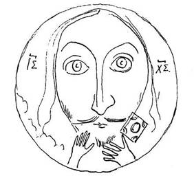

Опять дождь, опять слякоть. Настоящее безвыходное
положение. Старинны[е] нижегородские цер[к]ви меня просто
очаровали. Они так милы, так гармонически пестры, и отвратительная
погода не дает мне рисовать их. Я, однако ж, сегодня перехитрил
упрямую погоду. Рано поутру пошел в трактир, спросил себе чаю и
нарисовал из окна Благовещенский собор. Древнейшая в Нижнем
церковь. Нужно будет узнать время ее построения. Но от кого? К пьяным
косматым жрецам не хочется мне обращаться, а больше не к кому. Нижний
Новгород во многих отношениях интересный город и не имеет печатного
указателя. Дико! По-татарски дико!

