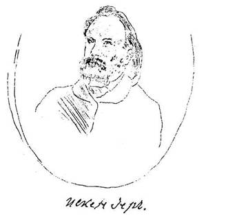

Сегодня вечером Варенцов возвратился из Петербурга и привез мне от
Кулиша письмо и только что отпечатанную его «Граматку». Как прекрасно,
умно и благородно составлен этот совершенно новый букварь. Дай
Бог, чтобы он привился в нашем бедном народе. Это первый свободный луч
света, могущий проникнуть в сдавленную попами невольничью голову.

Из Москвы Варенцов привез мне поклон от Щепкина, а от Бодянского поклон
и дорогой подарок, его книгу «О времени происхождения славянских
письмен» с образчиками древнего славянского шрифта. Сердечно благодарен
О[сипу] М[аксимовичу] за его бесценный подарок. Эта книга удивительно
как пополнила современную нашу историческую литературу.

Еще привез он для Н.К. Якоби свинцовым карандашом нарисованный портрет
нашего изгнанника, апостола Искандера. Портрет должен быть похож, потому
что не похож на рисунки в этом роде. Да если бы и не похож, то я
все-таки скопирую для имени этого святого человека.

