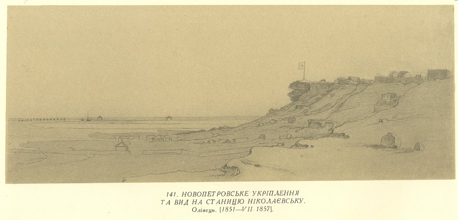
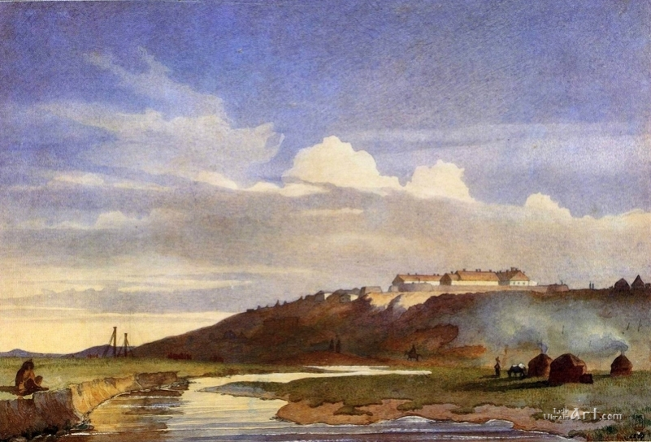

Щоденник Тараса Шевченка ("Щоденник", "Журнал") — записи Тараса
Григоровича Шевченка, які він робив протягом року після одержання
звістки про можливе звільнення з заслання і до приїзду в Петербург.

Вперше Щоденник надруковано в журналі "Основа" (1861, #5-12; 1862,
\#1-8) з численними купюрами, зашифруванням багатьох прізвищ і зміною
окремих слів та виразів.

Вперше, в перекладі українською мовою, Щоденник був опублікований 1893
року в Галичині під назвою "Записки, або Журнал Тараса Григоровича
Грушівського-Шевченка" в журналі "Правда", т. 18-19.

